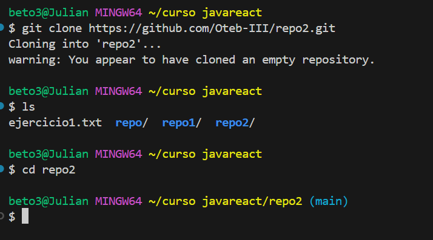
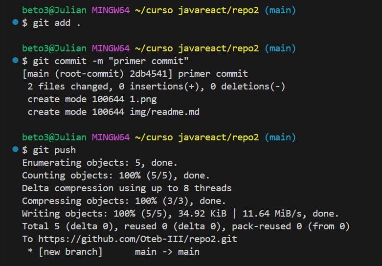

# Ejercicio dos
1. **Primer paso**
   - Crear un repositorio remoto, en nuestro caso usaremos github.  
  
2. **Segundo paso paso**
   - Clonar el respositorio remoto en local:
  
  
3. **Tercer Paso**
    - dirigirnos al repositorio que hemos clonado y abrirlo en *vsCode*.

4. **Cuarto Paso**
   - Crear el archivo readme, añadirlo con *git add*,  realizar el *commit* en local y realizar el *push* al repositorío remoto.
      

## Tabla de principales comandos de git:

|Comando Git | ¿Qué hace? | lifecycle |
|:--- |:----: |:----:| 
|  **git config --global --list**   | Muestra la configuración global actual |  |
|  **git init**   | Inicializa un nuevo repositorio Git en el directorio actual. | |
|   **git clone**  | Clona un repositorio existente desde una URL. |  |
|   **git status**  | Muestra el estado de los archivos en el directorio de trabajo |  |
|   **git add**  | Agrega un archivo específico al área de preparación. | Staging |
|   **git commit -m**  | Crea un nuevo commit con los cambios en el área de preparación. | Commits |
|   **git pull**  | Obtiene y fusiona los cambios. | Actualizar  |
|   **git push**  | sube los cambios al repositorio remoto. |   |
|   **git rm**  | remover los archivos del disco |   |

## Git Log
    - Historial del proyecto:
  - 